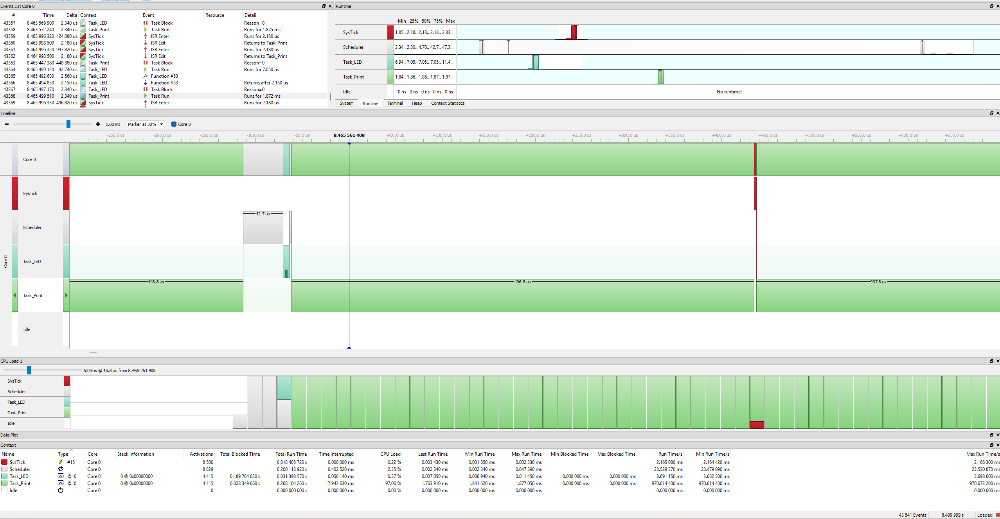

# SystemView Application

STM32F411CE real-time task analysis using SEGGER SystemView with OLED display integration.

## Features

- 📊 **SEGGER SystemView Integration** - Real-time task monitoring and analysis
- 🖥️ **OLED Display** - 128x64 SPI OLED for task status visualization  
- ⏱️ **Task Scheduling** - LED and Print tasks with timing analysis
- 📈 **Timer3 Input Capture** - 10 µs precision timing measurement (100MHz÷1000)
- 📝 **RTT Communication** - Real-Time Transfer for data logging

## Hardware Setup

- **Board:** BlackPill STM32F411CE (ARM Cortex-M4)
- **Display:** 128x64 SPI OLED 
- **Debug:** SEGGER J-Link (for SystemView)
- **LED:** PC13 (Built-in LED)
- **SPI:** SPI1 for OLED communication

## SystemView Analysis

<div align="center">
  
  <p><em>Real-time task execution timeline captured with SEGGER SystemView</em></p>
</div>

### Task Information
- **Task_LED:** Priority 10 - LED control and timing
- **Task_Print:** Priority 10 - OLED display updates


## Usage

1. **Build and Flash:**
   ```bash
   # Build with IAR EWARM
   # Flash to STM32F411CE
   ```

2. **SystemView Setup:**
   - Connect J-Link debugger
   - Open SEGGER SystemView
   - Start recording session
   - Analyze task timeline

3. **OLED Display:**
   - Shows task execution status
   - Displays timing information
   - Real-time performance data

## File Structure

| File | Description |
|------|-------------|
| `main.c` | Main application with SystemView integration |
| `oled.c/h` | OLED display driver and graphics functions |
| `spi.c/h` | SPI communication for OLED interface |
| `timer.c/h` | Timer3 Input Capture configuration (10µs precision) |
| `font_*.h` | Multiple font sizes for OLED display |
| `SYSVIEW_NoOS_Tasked.txt` | Task state list for sysview gui |

## Screenshots & Data

<style>
.screenshot-container {
  display: flex;
  align-items: center;
  margin: 10px 0;
}
.screenshot-icon {
  font-size: 1.2em;
  margin-right: 10px;
}
</style>

<div class="screenshot-container">
  <span class="screenshot-icon">📊</span>
  <strong>sysview.png</strong> - SystemView timeline analysis (shown above)
</div>

<div class="screenshot-container">
  <span class="screenshot-icon">📈</span>
  <strong>sysview_Export3.csv</strong> - Exported timing data for further analysis
</div>

## Documentation

Generate full documentation:
```bash
doxygen Doxyfile
```

Access at `docs/html/index.html`

## Performance Analysis

Real-time task scheduling analysis shows:
- Consistent task execution timing
- Low jitter and overhead
- Efficient resource utilization
- Deterministic response times

Perfect for real-time embedded system development and optimization!