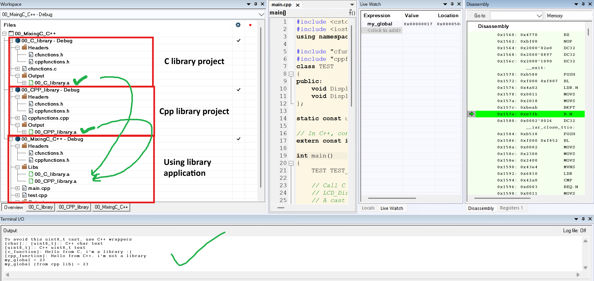
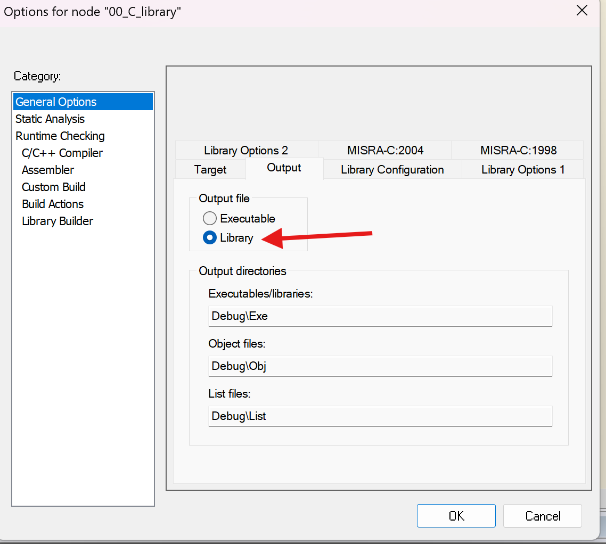

# C/C++ Mixed Programming Examples

This project contains example code for learning how to use C and C++ languages together.

## Project Structure

### Main Files
- `main.cpp` - Main program file with C++ class examples and main function
- `cfunctions.c/.h` - C function library files and common header file  
- `cppfunctions.cpp/.h` - C++ function library files and common header file
- `test.cpp` - Test functions

### Project Files
- `00_C_library.*` - C library project files
- `00_CPP_library.*` - C++ library project files  
- `00_MixingC_C++.*` - Main project files

## Topics Covered

### 1. Calling C Functions from C++
```cpp
// extern "C" required to call C function from C++
extern "C" {
    void C_DisplayString(const uint8_t *text);
}
```

### 2. Calling C++ Functions from C  
```cpp
// C linkage required to make C++ function callable from C
extern "C" {
    void cpp_function(int a, int b);
}
```

### 3. Type Casting and Wrapper Classes
- `TEST` class provides wrapper for different string types
- Safe conversion examples between `char*` and `uint8_t*`

### 4. Global Variable Sharing
```cpp
// extern required for global variables in C++
extern const int my_global = 23;
```

### 5. Library Architecture
- C library (`cfunctions`)
- C++ library (`cppfunctions`) 
- Main application (using different libraries)

## Build and Run

This project is prepared to be compiled with IAR Embedded Workbench.

### Build with IAR
1. Open `00_MixingC_C++.eww` workspace file
2. Select "Rebuild All" from Build menu
3. Select "Start Debugging" from Debug menu

## Generate Documentation

To generate documentation using Doxygen:

```bash
doxygen Doxyfile
```

Documentation can be accessed from `docs/html/index.html`.

## Important Points

### extern "C" Usage
- Required to call C functions from C++
- Required to call C++ functions from C
- Header files should use `#ifdef __cplusplus` check

### Type Safety
- Type casting between C and C++ should be done carefully
- Wrapper classes can improve type safety

### Linkage Issues
- C and C++ have different name mangling
- extern "C" prevents name mangling

## File Descriptions

| File | Description |
|------|-------------|
| `main.cpp` | Main program, TEST class and global variable definitions |
| `cfunctions.h/c` | C functions and extern "C" declarations |
| `cppfunctions.h/cpp` | C++ functions and C linkage examples |
| `test.cpp` | Global variable access test functions |

This project aims to teach C and C++ mixed programming techniques for embedded systems.

## Screenshots

### Project Workspace in IAR Embedded Workbench


### Project Build and Debug Configuration
